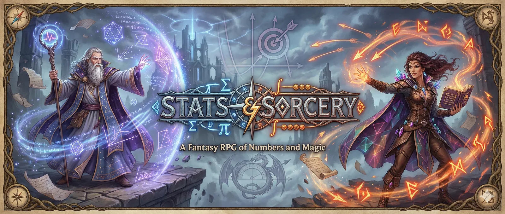

# Stats & Sorcery

*A wizard duelling game to build your statistical intuition.*

**[Play it in your browser](https://dominiquemakowski.github.io/StatsAndSorcery/)** (early prototype)

Spells never fly exactly where you aim, and the game won't show you where they'll go: each card tells you how its spell behaves, you guess, you cast, and the true 95% band appears as it flies. Line up, cast, dodge, bounce shots off the mirrored edges. After a few duels, spread, intervals and probabilities start to *feel* obvious.

Every card is an action (a spell, a movement or an alteration) that costs action points (★). Your spellbook starts with just two, **Flame** and **Move**. After each win you choose: learn a new action (first alterations that bend your spells, then spells that trade precision for power) or gain an extra heart.

## Development

Requires [Bun](https://bun.sh).

```sh
bun install
bun run dev      # dev server
bun test         # core rules & statistics tests
bun run build    # production build in dist/
```

`index.html` is Vite's source page, so it only works through `bun run dev`, or by building and serving `dist/`.

Every push to `main` is published to GitHub Pages, and every pull request gets its own playable preview linked in a comment (see `.github/workflows/`).

Design direction, art direction, architecture and conventions are in [AGENTS.md](AGENTS.md).
